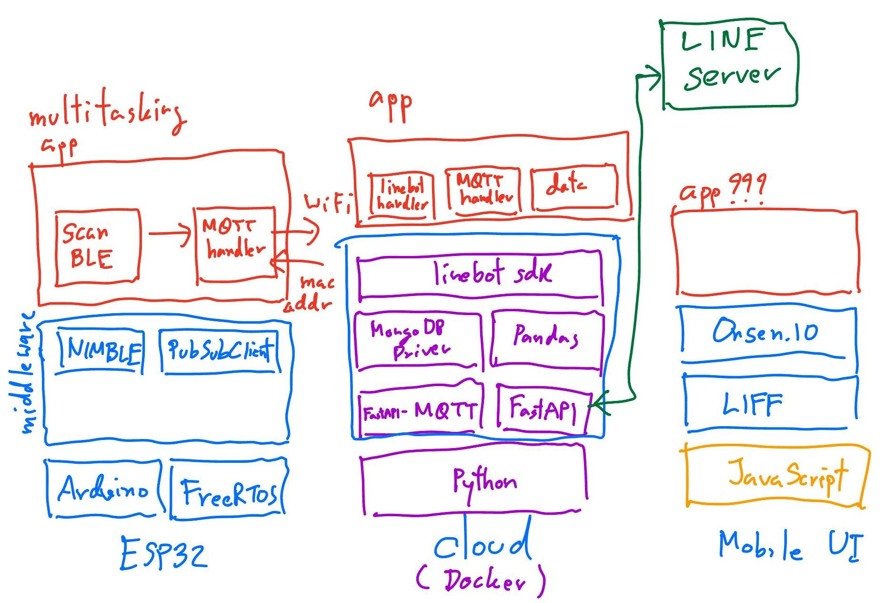

# ICT720 learning-by-doing

## Objectives
* Learn **concepts** related to AIoT software.
* Practice AIoT software development **skills** and **tools**.
* Experience team software development using a **case study**.

## Scope
1. Concepts: 
   * Lectures: L1(AIoT architecture), L2(software models), L3(), L4(), L5(), L6(), L7(), L8(), L9(), L10()
   * Practices: P1(cross-platform development/Bluetooth Low Energy), P2(multi-threading application), P3(), P4(), P6(), P7(), P8(), P9(), P10().
2. Skills:
   * Lectures: L1(user story), L2(UML diagram), L3(), L4(), L5(), L6(), L7(), L8(), L9(), L10().
   * Practices: P1(embedded programming/BLE programming), P2(state machine coding/RTOS programming), P3(), P4(), P6(), P7(), P8(), P9(), P10().
3. Tools: GitHub, VS Code, Platform.io, HiveMQ, 
4. Case study: MarTech using BLE beacon.

## User stories and acceptance criteria
1. As a **shop owner**, I want to **be notified when customers enter and leave** so that **promotion can be sent**.
   * Scenario: **customer visit**, given **customer is far**, when **customer is in the area**, then **ENTRY message is received ONCE**. 
   * Scenario: **customer leave**, given **customer is in the area**, when **customer is far away**, then **LEAVE message is received ONCE**.
2. As a **shop owner**, I want to **see how many customers in one of my shops** so that **I can understand the status now**.
   * Scenario: **density of a shop**, given **multiple detectors are activated**, when **a shop is selected**, then **the number of customers in that shop is displayed**.
   * Scenario: **density of all shops**, given **all detectors are activated**, when **ALL request is received**, then **list (shop id, numbers of customers) is reported**.
3. As a **shop owner**, I want to **see records of visiting customers** so that **I can decide promotion strategy**.
   * Scenario: **individual query**, given **user A records are in database**, when **user A is queried**, then **history (timestamp, period) of user A is responsed**.
   * Scenario: **group query**, given **records of multiple users are in database**, when **data is queried for given hour**, then **list of users being in that hour is responsed**.

## System requirements
### US1 tag_notification

### US2 shop_dashboard

### US3 shop_history

## Software architecture and behaviors
### US1 tag_notification
Software system consists of three software stacks for **BLE scanner**, **tag collector**, and **mobile UI**.

BLE scanner runs as two tasks: **BLE task** (low priority) and **MQTT task** (high priority).

BLE scanner detects BLE tags based on pre-configured MAC addresses. The status to be reported will be either **entry** or **exit**.

BLE scanner and cloud software will communicate through MQTT protocol. The list of **pre-configured MAC addresses** will be initialized by cloud software, while BLE scanner will report MAC addresses as either entry/exit.

### US2 shop_dashboard

### US3 shop_history

## Software implementation
### Firmware development

### LINE bot development

### LIFF UI development

